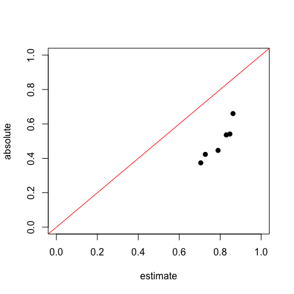

RFpurify
================

R-package to predict ABSOLUTE and ESTIMATE tumor purity using a Random Forest regression model trained on TCGA Illumina 450k DNA-methylation array data. Purity prediction functions can be applied to 450k and 850k array data preprocessed with the Bioconductor package [minfi](https://bioconductor.org/packages/release/bioc/html/minfi.html).

Install minfi and RF\_purify package from GitHub
------------------------------------------------

``` r
if(!require(minfi)){
  if(!requireNamespace("BiocManager", quietly = TRUE))
    install.packages("BiocManager")
  BiocManager::install("minfi")
}

if(!require(devtools)) install.packages("devtools")   
library(devtools)
# prevent warnings from beeing converted to errors when calling install_github
Sys.setenv(R_REMOTES_NO_ERRORS_FROM_WARNINGS=TRUE)
install_github('mwsill/RFpurify')
```

Example
-------

#### Install minfiData with example data

``` r
if(!require(minfiData)){
  if(!requireNamespace("BiocManager", quietly = TRUE))
    install.packages("BiocManager")
  BiocManager::install("minfiData")
}
```

#### Predict tumor purity

``` r
library(RFpurify)
library(minfiData)

# load example data
data(MsetEx)
MsetEx
```

    ## class: MethylSet 
    ## dim: 485512 6 
    ## metadata(0):
    ## assays(2): Meth Unmeth
    ## rownames(485512): cg00050873 cg00212031 ... ch.22.47579720R
    ##   ch.22.48274842R
    ## rowData names(0):
    ## colnames(6): 5723646052_R02C02 5723646052_R04C01 ...
    ##   5723646053_R05C02 5723646053_R06C02
    ## colData names(13): Sample_Name Sample_Well ... Basename filenames
    ## Annotation
    ##   array: IlluminaHumanMethylation450k
    ##   annotation: ilmn12.hg19
    ## Preprocessing
    ##   Method: Raw (no normalization or bg correction)
    ##   minfi version: 1.21.2
    ##   Manifest version: 0.4.0

``` r
# predict purity
absolute <- predict_purity(MsetEx,method="ABSOLUTE")
estimate <- predict_purity(MsetEx,method="ESTIMATE")

# plot predicted ABSOLUTE purity against ESTIMATE purity
plot(x=estimate,y=absolute,pch=19,ylim=c(0,1),xlim=c(0,1))
abline(a=0,b=1,col="red")
```


